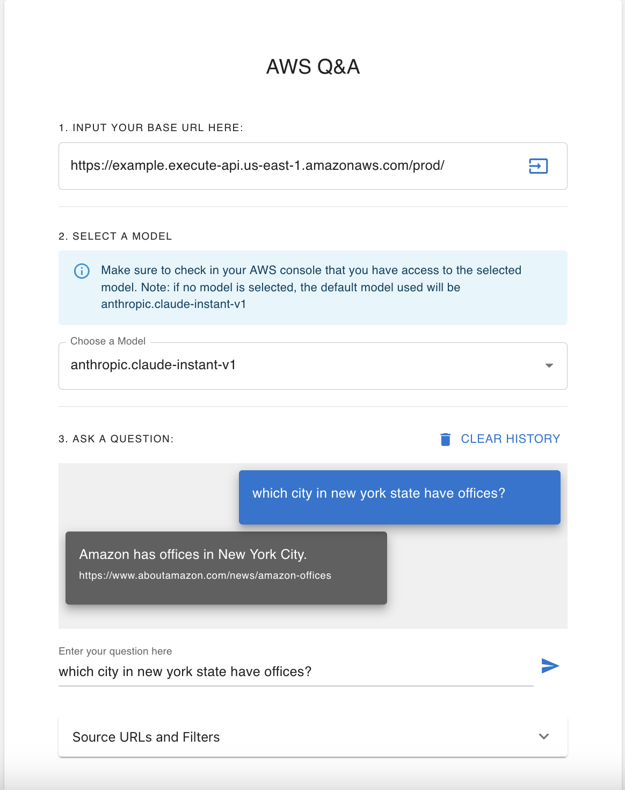
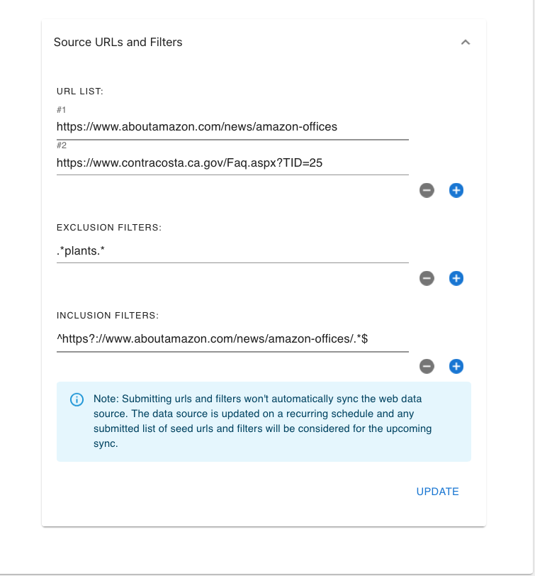
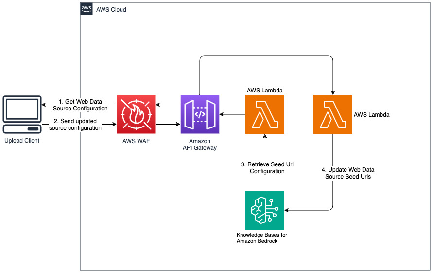

# Implement a fully managed RAG solution using Knowledge Bases for Amazon Bedrock
Retrieval-Augmented Generation (RAG) is the process of optimizing the output of a large language model, so it references an authoritative knowledge base outside of its training data sources before generating a response. Large Language Models (LLMs) are trained on vast volumes of data and use billions of parameters to generate original output for tasks like answering questions, translating languages, and completing sentences. RAG extends the already powerful capabilities of LLMs to specific domains or an organization's internal knowledge base, all without the need to retrain the model. It is a cost-effective approach to improving LLM output so it remains relevant, accurate, and useful in various contexts. Learn more about RAG [here](https://aws.amazon.com/what-is/retrieval-augmented-generation/).

[Amazon Bedrock](https://aws.amazon.com/bedrock/) is a fully managed service that offers a choice of high-performing foundation models (FMs) from leading AI companies like AI21 Labs, Anthropic, Cohere, Meta, Stability AI, and Amazon via a single API, along with a broad set of capabilities you need to build generative AI applications with security, privacy, and responsible AI. Using Amazon Bedrock, you can easily experiment with and evaluate top FMs for your use case, privately customize them with your data using techniques such as fine-tuning and RAG, and build agents that execute tasks using your enterprise systems and data sources. Since Amazon Bedrock is serverless, you don't have to manage any infrastructure, and you can securely integrate and deploy generative AI capabilities into your applications using the AWS services you are already familiar with.

[Knowledge Bases for Amazon Bedrock](https://aws.amazon.com/bedrock/knowledge-bases/) is a fully managed capability that helps you implement the entire RAG workflow from ingestion to retrieval and prompt augmentation without having to build custom integrations to data sources and manage data flows. Session context management is built in, so your app can readily support multi-turn conversations.

## Usecase
Need to find areas where Amazon is increasing investments to support future growth. The questions related to this exploration will be asked in a natural language by humans. The response need to include a reference to the source document. 

## User Experience



## Solution Architecture
The following solution architecture shows a workflow and a combination of AWS services to support the usecase described above.
 

- Note that with Amazon OpeSearch Serverless, you will be billed for [4 OCUs at a minimum](https://aws.amazon.com/opensearch-service/pricing/#Amazon_OpenSearch_Serverless) at all times. Follow instructions in the [Cleanup](#cleanup) section to avoid charges.

## Deploy solution

### Prerequisite
- Install and configure [AWS CLI](https://aws.amazon.com/cli/)
- Install and bootstrap [AWS CDK](https://aws.amazon.com/cdk/)
- Pick a region from the Amazon Bedrock [Supported Regions](https://docs.aws.amazon.com/bedrock/latest/userguide/bedrock-regions.html)

### Backend
- Clone this repository to your local computer. 
- From the backend folder, run "npm install" to install all dependencies. Use "npm audit" to check for known vulnerabilites on the dependent packages.
- Use CDK to deploy the backend to AWS. For example,
```
cdk deploy --context allowedip="xxx.xxx.xxx.xxx/32"
```
Provide an client IP address that is allowed to access the API Gateway in CIDR format as part of the 'allowedip' context variable. 

When the deployment completes,
- Make note of the API Gateway URL shown at BackendStack.APIGatewayUrl output.
- Make note of the S3 bucket name shown at BackendStack.DocsBucketName output.

### Amazon Bedrock foundational model
This solution allows users to select which foundational model they want to use during the retrieval and generation phase. The default model is **Anthropic Claude Instant**. For the knowledge base embedding model, this solution uses **Amazon Titan Embeddings G1 - Text** model. Make sure you have [access to these foundation models](https://docs.aws.amazon.com/bedrock/latest/userguide/model-access.html).

### Upload web content
This solution initializes the web data source with the url `https://www.aboutamazon.com/news/amazon-offices`. There are two ways the seed urls and filter list can be updated: via the console or using the frontend web url form. Note, once you update the seed urls this does not trigger an ingestion job. Ingestion jobs occur every 12 days. If you wish to change this value, the recurrence schedule can be updated in the `backend-stack.js` file.

### Upload content to S3 bucket
Get a recent publicly available Amazon's annual report and copy it to the S3 bucket name noted previously. For a quick test, you can copy the [Amazon's 2022 annual report](https://s2.q4cdn.com/299287126/files/doc_financials/2023/ar/Amazon-2022-Annual-Report.pdf) using the [AWS S3 Console](https://docs.aws.amazon.com/AmazonS3/latest/userguide/upload-objects.html).

### Frontend 
- From the frontend folder, run "npm install" to install the packages.
- Optionally, you can run "npm audit --omit=dev" to check on vulnerabilities.
- Run "npm run start" to launch the frontend application from the browser. 
- Use the user interface shown in the browser.
- For Step 1, enter the API Gateway endpoint URL noted previously.
- For Step 2, you can enter a question of the form "Which cities have offices?" and press the enter key to see the generated answer including a citation.


## Cleanup
In the AWS console, go to the Amazon Bedrock microservice and select the knowledge base configured with your backend stack. Select the `WebCrawlerDataSource` and click delete. Then use "cdk destroy" to delete the stack of cloud resources created in this solution deployment.

## Security checks
- npm audit is used to confirm there are no vulnerabilities.
- SonarLint is used in VS Code to confirm there are no problems detected in the codebase.
- [Amazon CodeWhisperer](https://aws.amazon.com/codewhisperer/) security checks are run to confirm there are no issues in the codebase.
- S3 bucket created in this project is setup to enforce ssl requests only and encrypt data at rest.
- S3 bucket is setup to block public access.
- API Gateway is setup with AWS Web Application Firewall to allow requests from a specific IP address only.

## Credit
- [Knowledge Bases now delivers fully managed RAG experience in Amazon Bedrock](https://aws.amazon.com/blogs/aws/knowledge-bases-now-delivers-fully-managed-rag-experience-in-amazon-bedrock/)
- [Building Serverless Resume AI](https://community.aws/content/2bi5tqITxIperTzMsD3ohYbPIA4/easy-rag-with-amazon-bedrock-knowledge-base?lang=en)
- [Implementing Web Crawling in Amazon Bedrock](https://aws.amazon.com/blogs/machine-learning/implement-web-crawling-in-knowledge-bases-for-amazon-bedrock/)